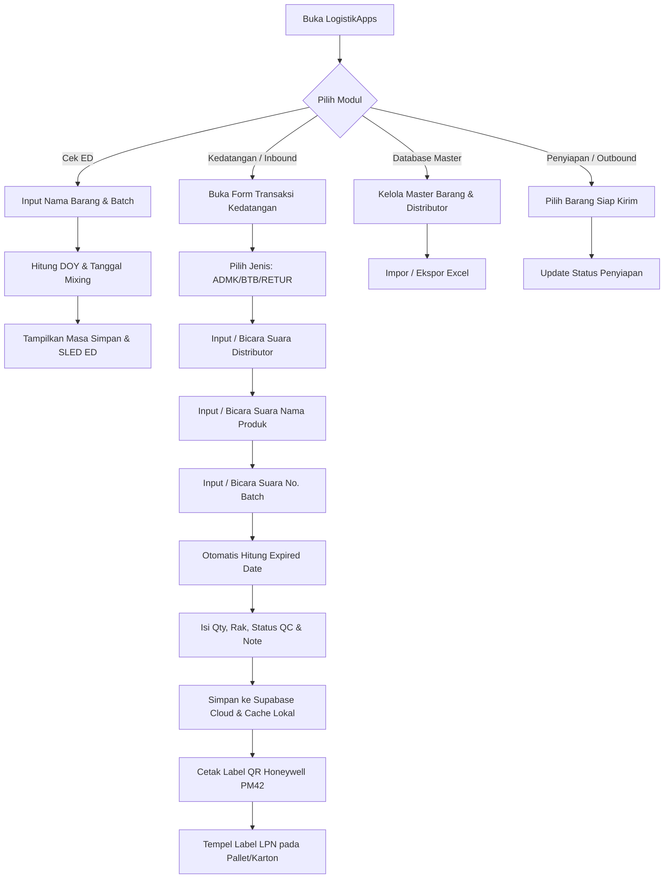

# Product Requirement Document (PRD) & Blueprint Arsitektur Sistem
## LogistikApps (Aplikasi Logistik & Pergudangan Terintegrasi)

---

## 1. Ringkasan Eksekutif & Visi Produk

**LogistikApps** adalah platform manajemen logistik dan pergudangan modern berbasis web (Progressive Web Application - PWA) yang dirancang khusus untuk operasional pergudangan *Fast-Moving Consumer Goods (FMCG)*, farmasi, dan distribusi ritel. 

Aplikasi ini mengintegrasikan alur kerja gudang dari hulu ke hilir:
1. **Pemeriksaan & Kalkulasi Otomatis Expired Date (ED / SLED)** dari kode batch dan tanggal mixing/produksi (*Julian Day of Year*).
2. **Pengelolaan Master Data Terpusat** (Master Barang & Master Distributor).
3. **Transaksi Kedatangan / Inbound (Incoming)** dengan dukungan *Speech-to-Text* (pencarian suara), kalkulasi ED otomatis, pemindaian QR/Barcode, dan *real-time cloud synchronization* (Supabase).
4. **Generator Label & QR Code Khusus Honeywell PM42 / Printer Industri** dengan dukungan *Direct Protocol (Intermec/Fingerprint)*, *Zebra Programming Language (ZPL II)*, dan *Direct Print Autosense Ready*.
5. **Modul Operasional Lanjutan**: Penyiapan Barang (Outbound), Stock Opname (Agregasi SUMIFS), Pemusnahan (Disposal), Rekondisi (Reco), Repack / Bundling Promo, dan Generator Serial Number (LPN).
6. **Sistem Notifikasi & Siaran Siaga (Broadcast)** dengan sintesis audio alarm dan prioritas tugas.

---

## 2. Arsitektur Teknologi & Tech Stack

### 2.1 Frontend & Runtime
- **Framework & Core**: React 18+ dengan TypeScript (Strict Type Safety)
- **Build Tool**: Vite 6+ (Fast ESM Bundler)
- **Styling**: Tailwind CSS (Utility-First CSS) dengan palet warna korporat netral yang ergonomis bagi pekerja lapangan
- **Animasi & Transisi**: `motion` (`motion/react`)
- **Ikonografi**: `lucide-react` (Konsisten dan terstandardisasi)
- **Pencarian Cerdas (Fuzzy Search)**: `fuse.js` (Toleran terhadap saltik/typo dan variasi input suara)
- **Pengenalan Suara (Speech Recognition)**: Web Speech API (`webkitSpeechRecognition` / `SpeechRecognition`) dengan lokalisasi bahasa Indonesia (`id-ID`)
- **Olah Data Spreadsheet**: `xlsx` (SheetJS) untuk impor/ekspor data ribuan baris tanpa lag
- **Generator Barcode & QR Code**: `qrcode`, `jsbarcode`
- **Kompresi Berkas**: `jszip` untuk ekspor label batch dalam format ZIP
- **Audio Engine**: Web Audio API Synthesizer (`broadcastSound.ts`) untuk efek suara notifikasi, peringatan darurat, dan konfirmasi scanner

### 2.2 Backend & Database
- **BaaS Database**: Supabase PostgreSQL Cloud Database
- **Konektivitas**: `@supabase/supabase-js` dengan *chunked pagination* (tanpa batas 1000 baris bawaan)
- **Offline-First Caching**: Dual-Layer Persistence (LocalStorage Fallback + Supabase Realtime Sync)
- **Kemanan Akses**: Role-Based Access Control (Admin vs. Pelaksana/Operator)

---

## 3. Skema & Struktur Database SQL (Supabase PostgreSQL)

Berikut adalah struktur lengkap DDL SQL untuk seluruh tabel, indeks, trigger, dan view:

```sql
-- ==============================================================================
-- LOGISTIKAPPS DATABASE SCHEMA (SUPABASE POSTGRESQL)
-- ==============================================================================

CREATE EXTENSION IF NOT EXISTS "uuid-ossp";
CREATE EXTENSION IF NOT EXISTS "pgcrypto";

-- Trigger Otomatis Pembaruan Kolom updated_at
CREATE OR REPLACE FUNCTION public.handle_updated_at()
RETURNS TRIGGER AS $$
BEGIN
    NEW.updated_at = TIMEZONE('utc'::text, NOW());
    RETURN NEW;
END;
$$ LANGUAGE plpgsql;

-- 1. TABEL USERS (Autentikasi Pengguna & Hak Akses)
CREATE TABLE IF NOT EXISTS public.users (
    id TEXT PRIMARY KEY,
    username VARCHAR(100) UNIQUE NOT NULL,
    nama VARCHAR(255) NOT NULL,
    pin VARCHAR(20) NOT NULL,
    avatar TEXT,
    role VARCHAR(50) NOT NULL DEFAULT 'Pelaksana', -- 'Admin' | 'Pelaksana'
    status VARCHAR(50) NOT NULL DEFAULT 'Aktif',   -- 'Aktif' | 'Nonaktif'
    email_google VARCHAR(255) DEFAULT '',
    permissions JSONB NOT NULL DEFAULT '{
        "canInputIncoming": true,
        "canTally": true,
        "canEditMasterBarang": false,
        "canManageUsers": false,
        "canApproveQC": false,
        "canAccessDatabase": false
    }'::jsonb,
    created_at TIMESTAMPTZ DEFAULT TIMEZONE('utc'::text, NOW()) NOT NULL,
    updated_at TIMESTAMPTZ DEFAULT TIMEZONE('utc'::text, NOW()) NOT NULL
);

CREATE INDEX IF NOT EXISTS idx_users_username ON public.users(username);
CREATE INDEX IF NOT EXISTS idx_users_role ON public.users(role);

-- 2. TABEL DATA_BARANG (Master SKU & Barcode)
CREATE TABLE IF NOT EXISTS public.data_barang (
    item_code VARCHAR(100) PRIMARY KEY NOT NULL,
    barcode VARCHAR(100),
    item_name VARCHAR(255) NOT NULL,
    status VARCHAR(50) NOT NULL DEFAULT 'Aktif',
    created_at TIMESTAMPTZ DEFAULT TIMEZONE('utc'::text, NOW()) NOT NULL,
    updated_at TIMESTAMPTZ DEFAULT TIMEZONE('utc'::text, NOW()) NOT NULL
);

CREATE INDEX IF NOT EXISTS idx_data_barang_barcode ON public.data_barang(barcode);
CREATE INDEX IF NOT EXISTS idx_data_barang_status ON public.data_barang(status);

-- 3. TABEL DATA_DISTRIBUTOR (Master Distributor & Kode LD)
CREATE TABLE IF NOT EXISTS public.data_distributor (
    kode_ld VARCHAR(50) PRIMARY KEY NOT NULL,
    nama_distributor VARCHAR(255) NOT NULL,
    status VARCHAR(50) NOT NULL DEFAULT 'Aktif',
    created_at TIMESTAMPTZ DEFAULT TIMEZONE('utc'::text, NOW()) NOT NULL,
    updated_at TIMESTAMPTZ DEFAULT TIMEZONE('utc'::text, NOW()) NOT NULL
);

CREATE INDEX IF NOT EXISTS idx_data_distributor_nama ON public.data_distributor(nama_distributor);

-- 4. TABEL INCOMING (Transaksi Kedatangan Barang / Inbound)
CREATE TABLE IF NOT EXISTS public.incoming (
    id_incoming VARCHAR(100) PRIMARY KEY NOT NULL,
    jenis VARCHAR(100) DEFAULT 'ADMK',           -- ADMK, BTB, RETUR
    id_distributor VARCHAR(50),
    distributor VARCHAR(255),
    item_code VARCHAR(100) NOT NULL,
    item_name VARCHAR(255) NOT NULL,
    category VARCHAR(100) DEFAULT 'Finished Good',
    location VARCHAR(100) DEFAULT 'WH-A-01',
    location_type VARCHAR(50) DEFAULT 'Rack',
    first_qty NUMERIC(12,2) DEFAULT 0,
    last_qty NUMERIC(12,2) DEFAULT 0,
    uom VARCHAR(50) DEFAULT 'CTN',
    qty_convert NUMERIC(12,2) DEFAULT 0,
    uom_convert VARCHAR(50) DEFAULT 'PCS',
    lpn_serial_number VARCHAR(100),
    batch VARCHAR(100),
    vendor_batch VARCHAR(100),
    sloc VARCHAR(50) DEFAULT 'SL01',
    expired_date DATE,
    destination_code VARCHAR(100) DEFAULT 'DST-01',
    qc_code VARCHAR(50) DEFAULT 'Lulus',          -- Lulus, Karantina, Repack, Reject
    user_tally VARCHAR(100) DEFAULT 'Tally 1',
    shelf_life VARCHAR(50) DEFAULT '24 Bulan',
    source VARCHAR(100) DEFAULT 'Supplier',
    user_input VARCHAR(100) DEFAULT 'Admin',
    tanggal_update TIMESTAMPTZ DEFAULT TIMEZONE('utc'::text, NOW()),
    status VARCHAR(50) DEFAULT 'OPEN',            -- OPEN | CLOSE
    tujuan VARCHAR(255) DEFAULT 'Warehouse Utama', -- Menampung catatan / tujuan internal
    created_at TIMESTAMPTZ DEFAULT TIMEZONE('utc'::text, NOW()) NOT NULL,
    updated_at TIMESTAMPTZ DEFAULT TIMEZONE('utc'::text, NOW()) NOT NULL
);

CREATE INDEX IF NOT EXISTS idx_incoming_item_code ON public.incoming(item_code);
CREATE INDEX IF NOT EXISTS idx_incoming_batch ON public.incoming(batch);
CREATE INDEX IF NOT EXISTS idx_incoming_created_at ON public.incoming(created_at DESC);

-- 5. TABEL DATA_PENYIAPAN (Outbound Staging)
CREATE TABLE IF NOT EXISTS public.data_penyiapan (
    id_penyiapan VARCHAR(100) PRIMARY KEY NOT NULL,
    tujuan VARCHAR(255) DEFAULT 'Pengiriman Cabang',
    item_code VARCHAR(100) NOT NULL,
    item_name VARCHAR(255) NOT NULL,
    category VARCHAR(100) DEFAULT 'Finished Good',
    location VARCHAR(100) DEFAULT 'WH-B-01',
    location_type VARCHAR(50) DEFAULT 'Floor',
    first_qty NUMERIC(12,2) DEFAULT 0,
    last_qty NUMERIC(12,2) DEFAULT 0,
    uom VARCHAR(50) DEFAULT 'CTN',
    qty_convert NUMERIC(12,2) DEFAULT 0,
    uom_convert VARCHAR(50) DEFAULT 'PCS',
    lpn_serial_number VARCHAR(100),
    batch VARCHAR(100),
    vendor_batch VARCHAR(100),
    sloc VARCHAR(50) DEFAULT 'SL02',
    expired_date DATE,
    destination_code VARCHAR(100) DEFAULT 'DST-02',
    qc_code VARCHAR(50) DEFAULT 'QC-PASS',
    user_tally VARCHAR(100) DEFAULT 'Tally 2',
    shelf_life VARCHAR(50) DEFAULT '24 Bulan',
    source VARCHAR(100) DEFAULT 'Stok Gudang',
    user_input VARCHAR(100) DEFAULT 'Admin',
    tanggal_update TIMESTAMPTZ DEFAULT TIMEZONE('utc'::text, NOW()),
    status VARCHAR(50) DEFAULT 'Ready',
    note TEXT,
    created_at TIMESTAMPTZ DEFAULT TIMEZONE('utc'::text, NOW()) NOT NULL,
    updated_at TIMESTAMPTZ DEFAULT TIMEZONE('utc'::text, NOW()) NOT NULL
);

-- 6. TABEL BROADCAST (Pemberitahuan & Pengumuman Gudang)
CREATE TABLE IF NOT EXISTS public.broadcast (
    id TEXT PRIMARY KEY,
    sender_name VARCHAR(255) NOT NULL DEFAULT 'Pos Logistik',
    author_name VARCHAR(255) DEFAULT 'Pos Logistik',
    message TEXT NOT NULL,
    content TEXT,
    title VARCHAR(255),
    category VARCHAR(50) NOT NULL DEFAULT 'info',
    priority VARCHAR(20) NOT NULL DEFAULT 'Normal',
    device_info VARCHAR(100) DEFAULT 'Browser Web',
    is_pinned BOOLEAN NOT NULL DEFAULT false,
    is_active BOOLEAN NOT NULL DEFAULT true,
    created_at TIMESTAMPTZ DEFAULT TIMEZONE('utc'::text, NOW()) NOT NULL,
    updated_at TIMESTAMPTZ DEFAULT TIMEZONE('utc'::text, NOW()) NOT NULL
);

-- Realtime Replication
ALTER PUBLICATION supabase_realtime ADD TABLE public.users;
ALTER PUBLICATION supabase_realtime ADD TABLE public.data_barang;
ALTER PUBLICATION supabase_realtime ADD TABLE public.data_distributor;
ALTER PUBLICATION supabase_realtime ADD TABLE public.incoming;
ALTER PUBLICATION supabase_realtime ADD TABLE public.data_penyiapan;
ALTER PUBLICATION supabase_realtime ADD TABLE public.broadcast;
```

---

## 4. Struktur Folder & Organisasi Modul

```text
├── public/
│   ├── favicon.svg
│   ├── icon-192.png
│   ├── icon-512.png
│   └── manifest.json                # Web App Manifest (PWA)
├── src/
│   ├── components/
│   │   ├── logistics/
│   │   │   ├── BatchCheckerModule.tsx       # Cek batch massal & interpretasi tanggal
│   │   │   ├── DatabaseMasterModule.tsx     # Master Data Barang & Distributor
│   │   │   ├── EdCheckerModule.tsx          # Kalkulator Expired Date interaktif
│   │   │   ├── IncomingModule.tsx           # Inbound, Voice Input, QR & Excel Import
│   │   │   ├── LogisticsModal.tsx           # Container modal & detail view
│   │   │   ├── PenyiapanModule.tsx          # Outbound & Penyiapan Barang
│   │   │   ├── PromosiModule.tsx            # Pengelolaan stok item promosi
│   │   │   ├── QrGeneratorHoneywellModule.tsx # Generator QR & Direct Print PM42
│   │   │   ├── SnGeneratorModule.tsx        # Generator Serial Number / LPN otomatis
│   │   │   ├── StockOpnameModule.tsx        # Agregasi stok & audit gudang
│   │   │   └── SuratJalanModule.tsx         # Pembuatan & cetak dokumen jalan
│   │   ├── BroadcastBar.tsx                 # Banner pengumuman berjalan
│   │   └── Header.tsx                       # Navigasi utama, sinkronisasi & profil
│   ├── context/
│   │   ├── AuthContext.tsx                  # Context login & izin hak akses
│   │   └── NotificationContext.tsx          # Context toast & alarm audio
│   ├── utils/
│   │   ├── broadcastSound.ts                # Audio Synthesizer (Web Audio API)
│   │   ├── fuseSearch.ts                    # Fuzzy search helper (Fuse.js)
│   │   ├── logisticsCalculations.ts         # Rumus ED, DOY, Kabisat, SLED
│   │   └── systemNotification.ts            # PWA Web Push notification
│   ├── App.tsx                              # Entry component & routing modul
│   ├── index.css                            # Tailwind CSS styling & print stylesheet
│   ├── main.tsx                             # React DOM bootstrap
│   ├── pwa.ts                               # Service worker registration
│   ├── supabase.ts                          # Supabase Client & chunk fetcher
│   └── types.ts                             # Global TypeScript Interfaces
├── supabase_schema.sql                      # Script migrasi database Supabase
├── package.json
├── tsconfig.json
└── vite.config.ts
```

---

## 5. Logika Bisnis & Algoritma Inti

### 5.1 Algoritma Dekode Batch & Perhitungan Expired Date (ED / SLED)
Pada industri manufaktur FMCG dan farmasi, kode batch dicetak dengan format Unix Julian:
`[Prefix/Mesin][Nomor Batch][3 Digit DOY - Hari ke-N][1 Digit Akhir Tahun Produksi][Suffix Huruf]`
Contoh: **`L911346N`**

#### Langkah Perhitungan Matematis:
1. **Pembersihan Suffix**:
   Karakter huruf di akhir dihilangkan sehingga `L911346N` $\rightarrow$ `911346`.
2. **Ekstraksi 4 Digit Terakhir**:
   - 4 Digit Terakhir: `1346`
   - `DOY` (Day of Year): $\lfloor 1346 / 10 \rfloor = 134$ (Hari ke-134 dalam kalender tahunan).
   - `Digit Tahun Produksi`: $1346 \pmod{10} = 6$.
3. **Kalkulasi Tahun Produksi Aktual**:
   Menghitung tahun produksi terdekat yang tidak melebihi tahun berjalan:
   $$\text{Tahun} = \text{Tahun Berjalan} - (((\text{Tahun Berjalan} - \text{Digit Tahun}) \bmod 10) + 10) \bmod 10$$
   *(Jika tahun berjalan 2026, digit 6 diterjemahkan menjadi 2026 atau 2016 tergantung selisih terdekat)*.
4. **Kalkulasi Tanggal Mixing (Produksi)**:
   $$\text{Tgl Mixing} = \text{1 Januari Tahun Produksi} + (\text{DOY} - 1) \text{ hari}$$
5. **Penentuan Masa Simpan (Shelf Life)**:
   - Produk mengandung kata `PAPER` $\rightarrow$ Masa simpan 5 Tahun (60 Bulan).
   - Produk mengandung kata `OLIVE OIL` $\rightarrow$ Masa simpan 4 Tahun (48 Bulan).
   - Produk mengandung kata `Q-LIFE`, `KESET`, atau `SAMANTHA 20` $\rightarrow$ Masa simpan 2 Tahun (24 Bulan).
   - Produk mengandung kata `PIA` $\rightarrow$ Masa simpan 1 Tahun (12 Bulan).
   - Produk mengandung kata `ABSTRACT` $\rightarrow$ Non-Expired (`9999-12-31`).
   - Default Produk Lainnya $\rightarrow$ 3 Tahun (36 Bulan).
6. **Penanganan Tahun Kabisat (Leap Year)**:
   Jika tanggal jatuh pada `29 Februari` di tahun non-kabisat, tanggal otomatis disesuaikan ke hari terakhir bulan Februari (`28 Februari`).

---

### 5.2 Fitur Speech-to-Text (Pencarian & Input Suara Cerdas)
Fitur input suara diterapkan pada 3 field utama di form penerimaan barang (Inbound):
1. **Pencarian Nama Produk**: Menyebutkan nama barang atau kode SKU untuk memfilter data master barang secara interaktif.
2. **Pencarian Distributor**: Menyebutkan nama vendor atau kode distributor (LD) yang terhubung langsung ke master distributor.
3. **Nomor Batch**: Operator menyebutkan huruf dan angka (misal: *"L sembilan satu satu tiga empat enam"*), sistem secara otomatis mengonversi sebutan angka bahasa Indonesia (*kosong, nol, satu, dua, ...*) menjadi karakter alfanumerik kapital (*`L911346`*) dan langsung memicu kalkulasi Expired Date tanpa mengetik.

---

### 5.3 Generator Label & Spesifikasi Printer Honeywell PM42
Modul ini dirancang agar kompatibel dengan printer barcode industri Honeywell PM42 dengan spesifikasi:
- **Ukuran Label Standar**: `80 x 100 mm` (Orientasi Landscape: `100 mm` Lebar $\times$ `80 mm` Tinggi).
- **Dimensi Barcode QR Code**: `40 mm` dengan koreksi kesalahan standar Level `M` (15%).
- **Margin Standar**: Atas `10 mm`, Kiri `2 mm`, Ukuran Font `8 px` tebal.
- **Dukungan Perintah Bahasa Printer**:
  1. **Direct Protocol (Fingerprint / Intermec)**:
     ```text
     CLL
     OPTIMIZE "BATCH" ON
     BARFONT OFF
     PRPOS 20, 80
     DIR 1
     BARCODE "QR", "LPN00123984", 6, 2, "M"
     PRTXT 220, 80, "ITEM: 21104501 - KINO SAMANTHA"
     PRTXT 220, 110, "BATCH: L911346N | ED: 2029-05-14"
     PRINT 1
     ```
  2. **Zebra ZPL II**:
     ```text
     ^XA
     ^PW800
     ^LL640
     ^FO40,60^BQN,2,6^FDMM,LPN00123984^FS
     ^FO240,60^A0N,28,28^FDITEM: 21104501 - KINO SAMANTHA^FS
     ^FO240,100^A0N,24,24^FDBATCH: L911346N | ED: 2029-05-14^FS
     ^XZ
     ```
- **Direct Print Web Driver**: Menggunakan CSS `@page { size: 100mm 80mm landscape; margin: 0; }` sehingga operator dapat langsung mencetak dari browser ke Honeywell PM42 tanpa kalibrasi margin ulang.

---

## 6. Alur Operasional (Step-by-Step User Flow)



---

## 7. Petunjuk Instalasi & Deployment (Dari Nol)

### 7.1 Persyaratan Sistem
- Node.js versi 18.x atau 20.x LTS
- Package Manager: `npm` atau `bun`

### 7.2 Langkah Instalasi Lokal
```bash
# 1. Clone repositori
git clone <repository-url>
cd logistikapps

# 2. Instal dependensi
npm install

# 3. Buat berkas konfigurasi .env
cp .env.example .env
# Isi kredensial Supabase (VITE_SUPABASE_URL dan VITE_SUPABASE_ANON_KEY)

# 4. Jalankan development server
npm run dev
```

### 7.3 Pengaturan Database Supabase
1. Masuk ke dashboard [Supabase](https://supabase.com).
2. Buat proyek baru dan buka menu **SQL Editor**.
3. Salin seluruh isi berkas `supabase_schema.sql` dan jalankan (*Run*).
4. Pastikan tabel `users`, `data_barang`, `data_distributor`, `incoming`, `data_penyiapan`, dan `broadcast` berhasil terbuat.
5. Salin *Project URL* dan *Anon Key* dari menu **Project Settings > API** ke dalam berkas `.env`.

### 7.4 Build untuk Produksi
```bash
npm run build
```
Output static build akan berada di direktori `dist/` dan siap dideploy ke Vercel, Netlify, Cloud Run, atau server Nginx.

---

## 8. Ringkasan Fitur Terbaru yang Diimplementasikan
- ✅ **Penyederhanaan Navigasi**: Tombol ganda diganti dengan single Home Icon yang ergonomis.
- ✅ **Tombol Terpadu Sinkron & Refresh**: Menggabungkan aksi sinkronisasi offline-cache dan pembaruan data real-time dalam 1 klik.
- ✅ **Integrasi Speech-to-Text Lengkap**: Mendukung input suara pada pencarian produk, distributor, dan nomor batch dengan parsing angka otomatis.
- ✅ **Pembersihan UI & Form Inbound**: Menghilangkan istilah database teknis dan menyederhanakan kolom Catatan/Note secara intuitif.
- ✅ **Dukungan Cetak Label Honeywell PM42**: Kompatibilitas autosense ready 80x100mm landscape.
